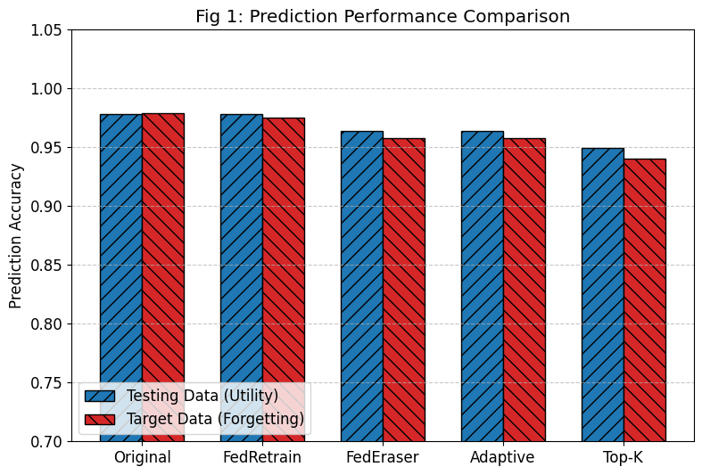
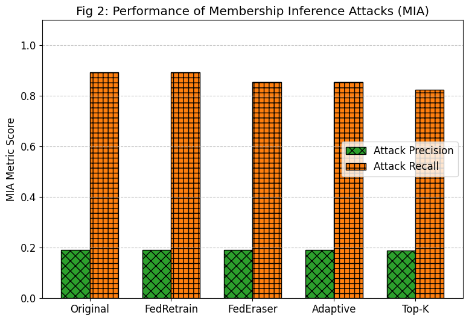
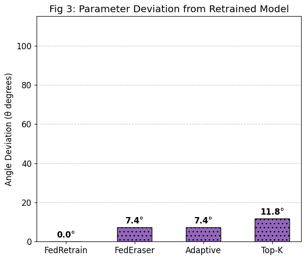
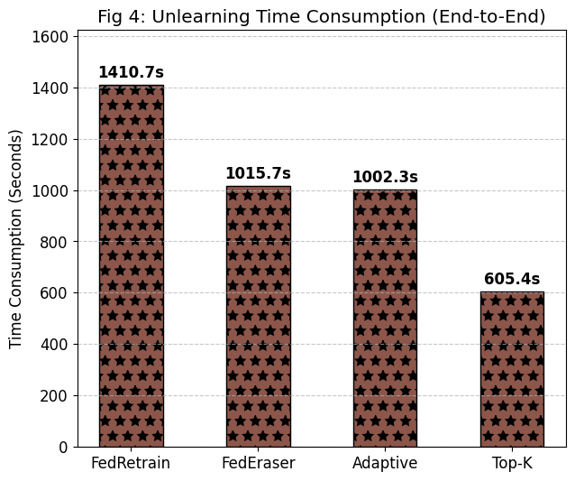

# Báo cáo Thực nghiệm: Tối ưu hóa Federated Unlearning với Top-K và Adaptive Threshold

Dự án này là một bản triển khai và mở rộng của thuật toán **FedEraser** trong môi trường Học máy Liên kết (Federated Learning) sử dụng framework Flower và PyTorch. 

Mục tiêu của dự án là loại bỏ triệt để ảnh hưởng từ dữ liệu của một client bất kỳ ra khỏi mô hình toàn cục (Global Model) mà không cần phải huấn luyện lại từ đầu, đồng thời đề xuất các phương pháp tối ưu mới (Top-K, Adaptive) nhằm tăng tốc quá trình "quên" (Unlearning).

## 📊 Các Phương Pháp So Sánh
1. **Original Model:** Mô hình ban đầu được huấn luyện trên toàn bộ dữ liệu của tất cả các clients.
2. **FedRetrain (Baseline):** Huấn luyện lại mô hình từ đầu sau khi loại bỏ dữ liệu của client mục tiêu. Đây là tiêu chuẩn vàng về khả năng xóa dữ liệu, nhưng tốn nhiều thời gian nhất.
3. **FedEraser:** Thuật toán xóa dữ liệu dựa trên việc hiệu chỉnh (calibration) lại các cập nhật lịch sử của các client còn lại.
4. **Adaptive (Đề xuất):** Tối ưu hóa FedEraser bằng cách sử dụng ngưỡng (Threshold) để bỏ qua các vòng cập nhật không có sự thay đổi lớn về trọng số.
5. **Top-K (Đề xuất):** Tối ưu hóa FedEraser bằng cách sử dụng hàng đợi ưu tiên (Priority Queue), chỉ giữ lại và hiệu chỉnh $K$ vòng huấn luyện có độ quan trọng cao nhất, giúp giảm thiểu đáng kể chi phí tính toán.

---

## 📈 Kết Quả Đánh Giá (Performance Evaluation)

### 1. Hiệu suất Dự đoán (Model Utility & Forgetting)
Biểu đồ dưới đây so sánh độ chính xác trên tập dữ liệu kiểm thử chung (**Testing Data** - đại diện cho tính hữu dụng của mô hình) và tập dữ liệu của client bị xóa (**Target Data** - đại diện cho mức độ "quên").

* Các phương pháp FedEraser, Adaptive và Top-K đều duy trì được độ chính xác trên Testing Data ở mức cao (tương đương FedRetrain).
* Độ chính xác trên Target Data của Top-K giảm xuống rõ rệt, chứng tỏ mô hình đã "quên" dữ liệu của client mục tiêu thành công.



### 2. Khả năng Phòng thủ Quyền riêng tư (MIA Attack)
Để kiểm chứng việc dữ liệu đã thực sự bị xóa, chúng tôi sử dụng phương pháp Tấn công Suy luận Thành viên (Membership Inference Attacks - MIA). 

* **MIA Recall** thể hiện tỷ lệ kẻ tấn công đoán trúng dữ liệu mục tiêu từng nằm trong tập huấn luyện.
* Cả FedEraser, Adaptive và đặc biệt là Top-K đều làm giảm đáng kể chỉ số MIA Recall so với mô hình gốc, chứng minh hiệu quả bảo vệ quyền riêng tư mạnh mẽ.



### 3. Độ Lệch Không Gian Tham Số (Parameter Deviation)
Chỉ số này đo lường góc lệch $\theta$ của các tham số ở layer cuối cùng giữa các mô hình Unlearned so với mô hình FedRetrain (Baseline).

* Nhờ việc cố định trọng số khởi tạo (Hardcoded Initial Weights), các phương pháp unlearning đều hội tụ về cùng một không gian tham số với mô hình chuẩn. 
* Góc lệch của FedEraser và Adaptive chỉ khoảng $7.4^\circ$, và Top-K là $11.8^\circ$. Điều này chứng minh các phương pháp xấp xỉ của chúng tôi tìm ra được bộ trọng số gần như tương đương với việc huấn luyện lại từ đầu.



### 4. Tổng Thời Gian Thực Thi (End-to-End Time Consumption)
Đây là minh chứng rõ ràng nhất cho tính hiệu quả của dự án. Thời gian tính toán bao gồm toàn bộ quá trình giao tiếp mạng và huấn luyện nội bộ tại client.

* **FedRetrain** mất nhiều thời gian nhất do phải chạy lại hàng chục vòng lặp.
* **FedEraser** và **Adaptive** giảm được đáng kể thời gian nhờ tái sử dụng lịch sử.
* Thuật toán **Top-K** cho thấy sự vượt trội tuyệt đối khi tiết kiệm được hơn 50% thời gian so với Baseline, trở thành phương pháp hiệu quả nhất để triển khai thực tế.



---

## 🚀 Hướng Dẫn Chạy Mã Nguồn (How to Run)

Dự án yêu cầu cài đặt môi trường với `flwr[simulation]`, `torch`, và `torchvision`. 

### Cập nhật hệ thống và cài đặt python3-venv nếu chưa có
```bash
sudo apt update
sudo apt install python3 python3-pip python3-venv -y
```

### Tạo môi trường ảo có tên 'unlearning_env'
```bash
python3 -m venv unlearning_env
```

### Kích hoạt môi trường ảo
```bash
source unlearning_env/bin/activate
```

### Cài đặt Flower framework và 1 số thư viện liên quan.
```bash
pip install --upgrade pip
pip install "flwr[simulation]" torch torchvision flwr-datasets datasets numpy
```
Để chạy liên tục toàn bộ quy trình (Train mô hình gốc $\rightarrow$ Unlearn bằng các phương pháp $\rightarrow$ Retrain baseline $\rightarrow$ Đánh giá và xuất biểu đồ), hãy thực thi chuỗi lệnh sau trong terminal:

```bash
flwr run . --run-config 'mode="train"' && \
flwr run . --run-config 'mode="unlearn" unlearn-cid="1"' && \
flwr run . --run-config 'mode="adaptive_train"' && \
flwr run . --run-config 'mode="adaptive_unlearn" unlearn-cid="1"' && \
flwr run . --run-config 'mode="topk_train"' && \
flwr run . --run-config 'mode="topk_unlearn" unlearn-cid="1"' && \
flwr run . --run-config 'mode="retrain"' && \
python3 evaluate_comparison.py
